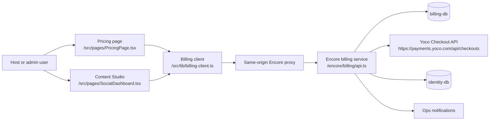
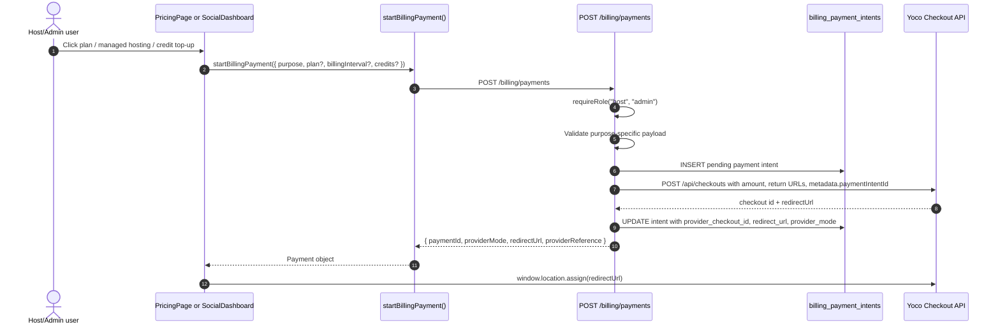
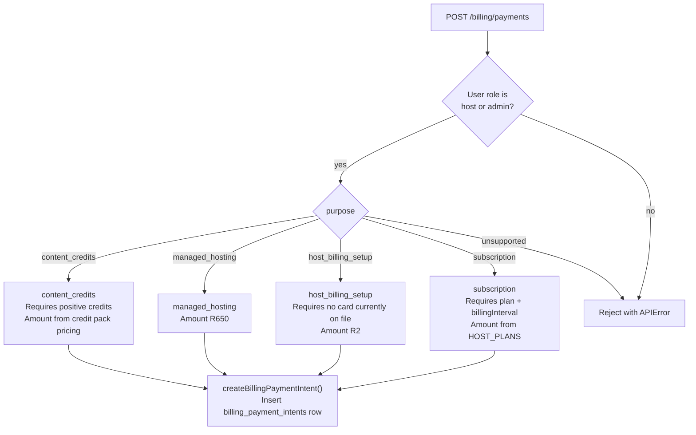
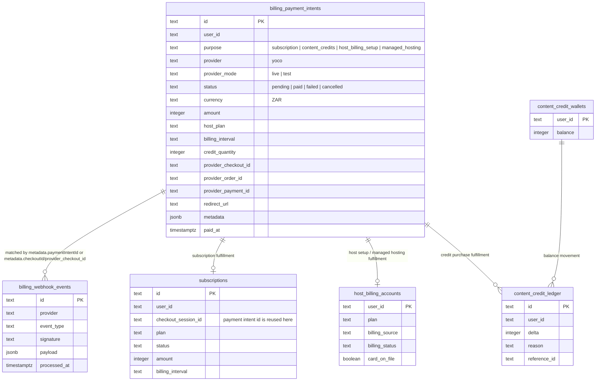
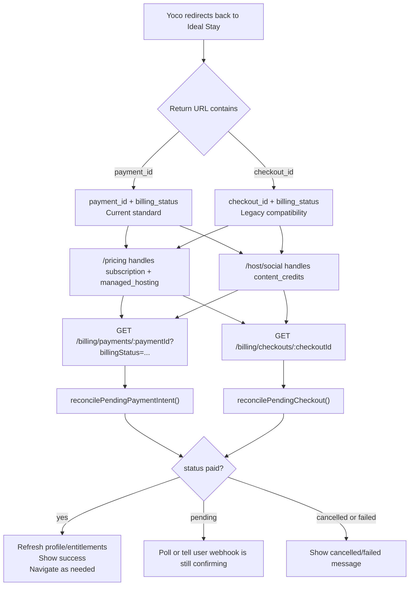
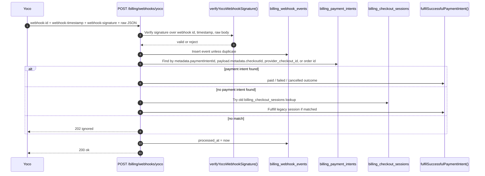
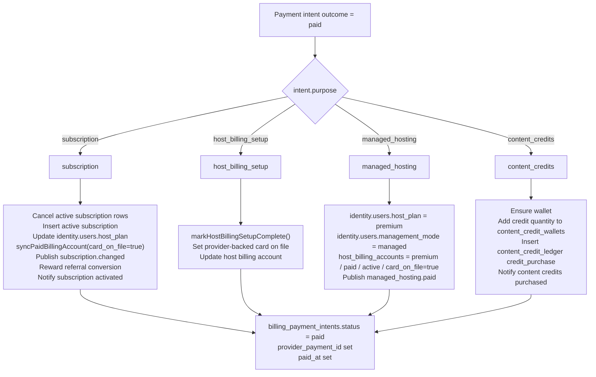
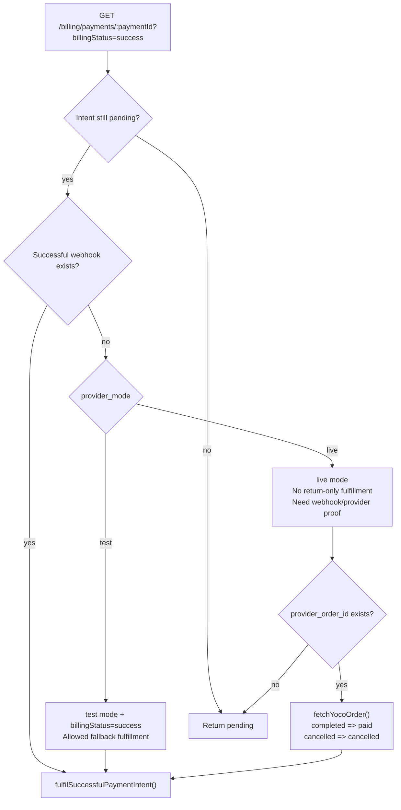
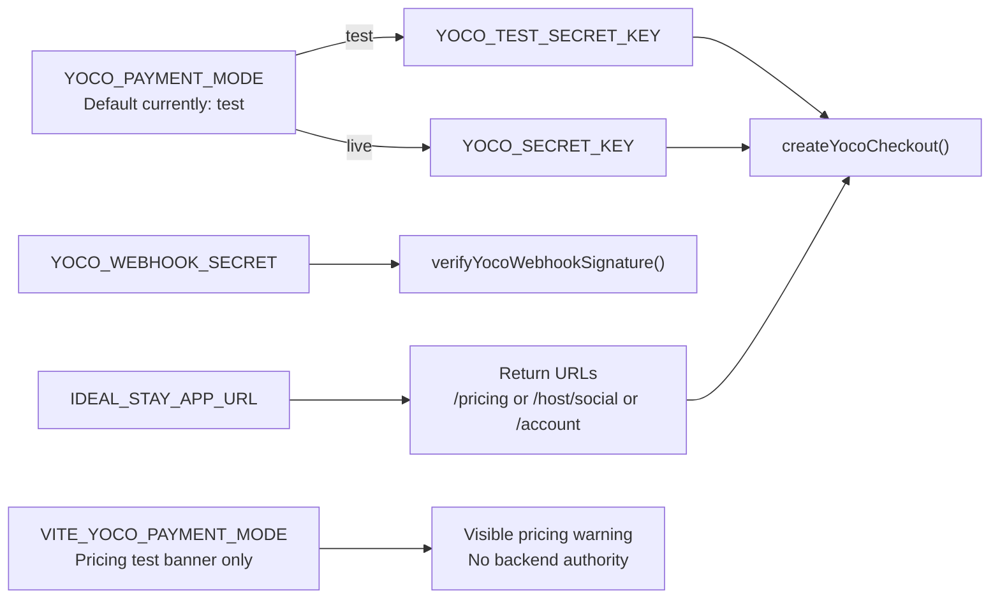

# Ideal Stay Payment Flow Diagrams

Author signature: (|/) Klaasvaakie

These diagrams describe the current payment flow in this checkout. The canonical path is `POST /billing/payments` -> `billing_payment_intents` -> Yoco Checkout -> webhook/status reconciliation. Older `billing_checkout_sessions` paths still exist only as compatibility for legacy return URLs and admin history.

## 1. System Context

## 2. Start Payment Sequence

## 3. Purpose Routing

## 4. Canonical Data Model

## 5. Return URL And Status Resolution

## 6. Webhook Reconciliation

## 7. Fulfillment By Purpose

## 8. Test Mode Fallback Boundary

## 9. Runtime Configuration

## Current Acceptance Check

- Current paid user-facing flows should start through `startBillingPayment(...)`.
- Current backend paid flows should enter through `POST /billing/payments`.
- New payment state should be stored in `billing_payment_intents`.
- Yoco Checkout payment webhooks must match intents through `payload.metadata.checkoutId` when `metadata.paymentIntentId` is absent.
- Live-mode fulfillment should require webhook or provider proof.
- Test-mode success-return fallback is intentionally narrow and only applies when `provider_mode = test` and `billingStatus=success`.
- Legacy `checkout_id` support should not become the default path again.
